# Homework 2: Git and GitHub
## Introduction
This homework is to let you experience using Git and GitHub yourself. After completing this homework, you should be familiar with how to work with these tools. The order of the tasks is as laid out in the PowerPoint slides. Finish all the tasks, and provide a link to your repository on the [training website](https://rbrevrt.hkust.edu.hk/training).  

To ensure you are doing Git properly, you need to edit the files before commiting. I ***WILL*** check your commit history. As a reminder, you can't fake commit history (unless you start from scratch).  

You are suggested use VSCode Source Control to complete this homework. You may also work with the Git cli if you wish but you will be on your own. Commits via the Git website would receive half credit, except when specified.

## Tasks
1. Creating your own repo
2. Pulling, committing, pushing
3. Branching
4. Merging
5. Pull Requests, resolving conflicts
6. CI/CD
7. Give answers to questions in `answers.md`

### Task 1: Creating your own repo
Go to [GitHub](https://github.com/) and create your own repo. In the top right, there is a `+` sign, then choose `New repository`.  
  

Fill in the information required for the new repo.
- Name: `rbr-sf-hw-2`
- Description: `Homework 2 submission for Red Bird Racing Software Training 2026.`
- Visisbility: `Public`
- Add README: `On`
- Add License: `GNU General Public License v3.0`
  

Press `Create repository` to create the repo. You should see the contents of your new repo.
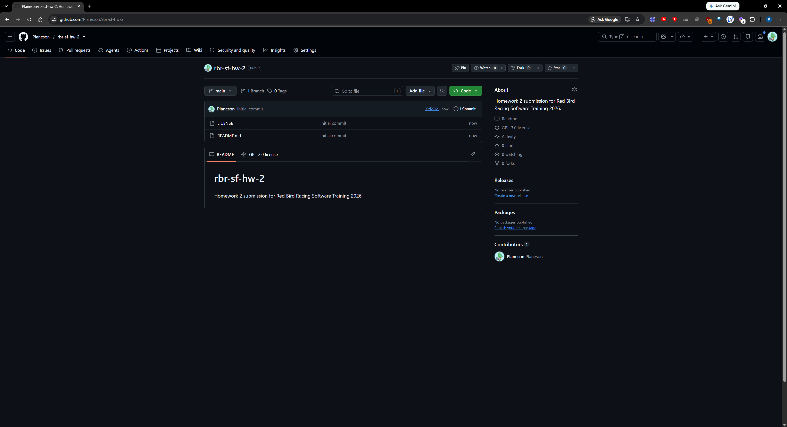  

### Task 2: Pulling, committing, pushing
Launch a new VSCode window. Make sure you are signed in (bottom left). Click `Clone Git Repository...`, then `Clone from GitHub`. 

You should see your newly created repo show up. Choose it to clone it.

Choose a place to store your repo, I suggest using a folder to hold all your GitHub repos, e.g. Documents/GitHub. A pop-up should appear, just choose `Open` (since this is already a new window; if you are doing this from an open window, then choose `Open in New Window`).

After the window finish loading, go to the left bar and choose `Source Control` (or use the shortcut Ctrl+Shift+G). This is basically the VSCode GUI for Git. You can go back to Explorer (Ctrl+Shift+E) to edit the files.
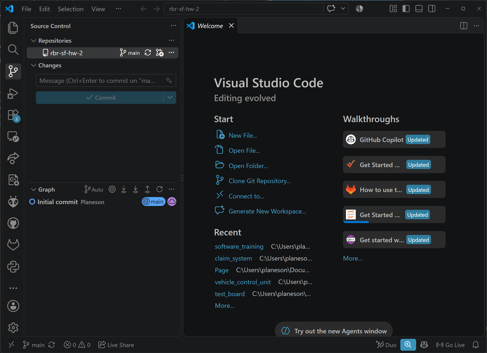

Go back to GitHub. Click `README.md` to open it.
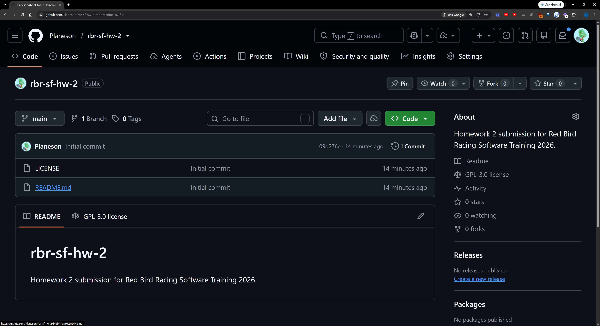
Press the `Edit this File` button to edit the file.
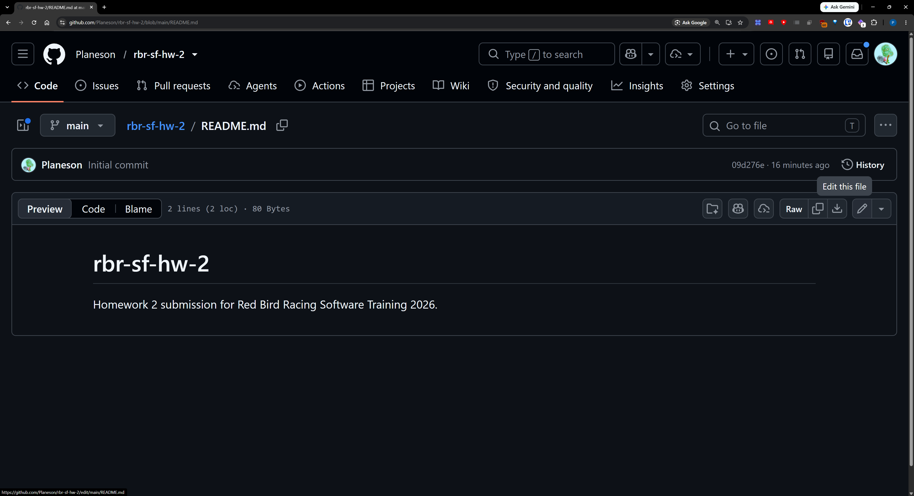
The file should open up. Add this line below it:  
`This is a commit from the GitHub website!`  
then press the green `Commit changes...` button.

The commit message should be `Update README.md from GitHub site`, and the extended description should be `README.md updated from the GitHub website GUI.`. Press the green `Commit changes` button to commit your changes.  
~ignore the typo on the images and example repo~

Note: this commit ***MUST*** be done from the GitHub website, else you receive half credit. 

Go back to VSCode. You should see that you have 1 commit down and 0 commits up. You can see the commit history on the Graph. Note the Incoming Changes from origin/main. Press the refresh button new to main to pull the commit down. You should pull every time you know or suspect there are upstream changes. After pulling the commit, the Incoming Changes line should disappear, and the colour of the tree should change.
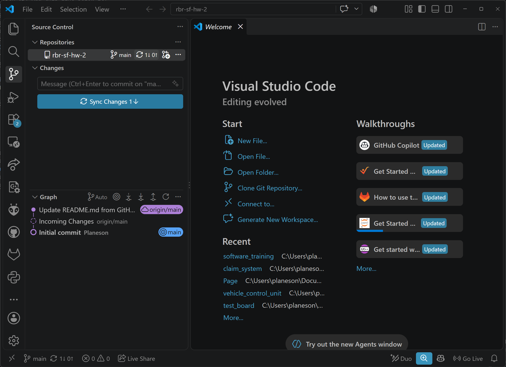
Click Explorer and open `README.md`. You should see the changes reflected. Right click README.md and choose `Reveal in File Explorer` to show the file in File Explorer.
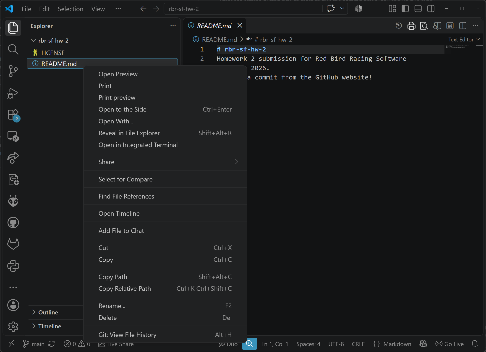

For simplicity sake, I provided altered files for you to "simulate" commits. Simply paste them from this repo into the repo you are submitting.

Copy everything inside [`commits/1`](commits/1) and paste it into the root of your repo. Your repo should now have `.gitignore`, `platformio.ini` and `src/main.cpp`, next to `LICENSE` and `README.md`. If you can't see `.gitignore`, your file explorer is hiding files that start with a dot, so paste from the VSCode Explorer instead.

Go back to Source Control. You should see the 3 new files show up under `Changes`. Press the `+` button next to `Changes` to stage all of them. The files should move to `Staged Changes`.
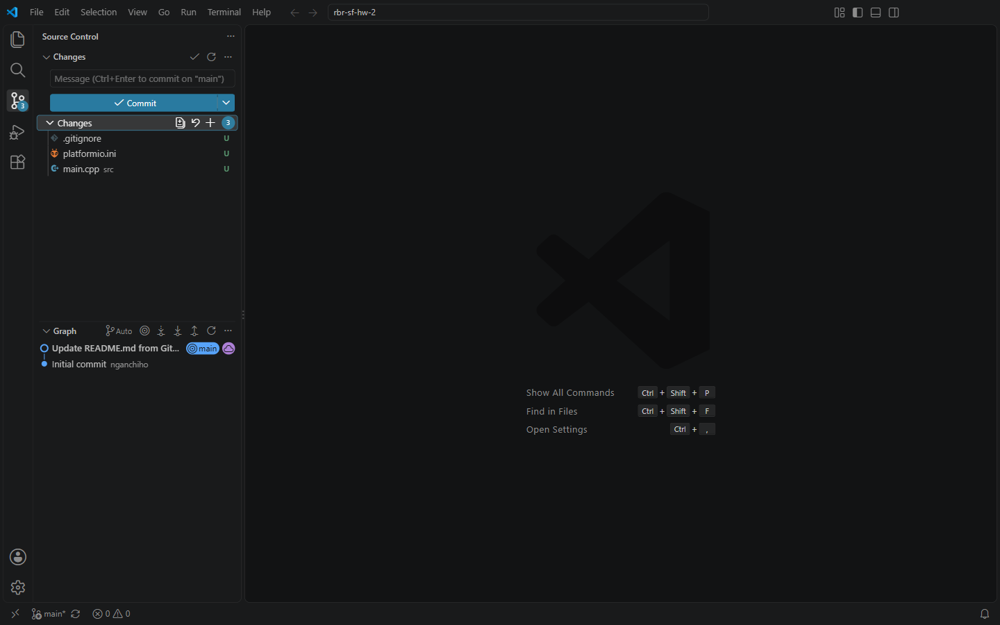

The commit message should be `Add PlatformIO project`. Press the blue `Commit` button to commit your changes. You should see that you have 0 commits down and 1 commit up. Press the `Sync Changes` button to push the commit up. You should push every time you finish a commit, so your work is not only on your computer.
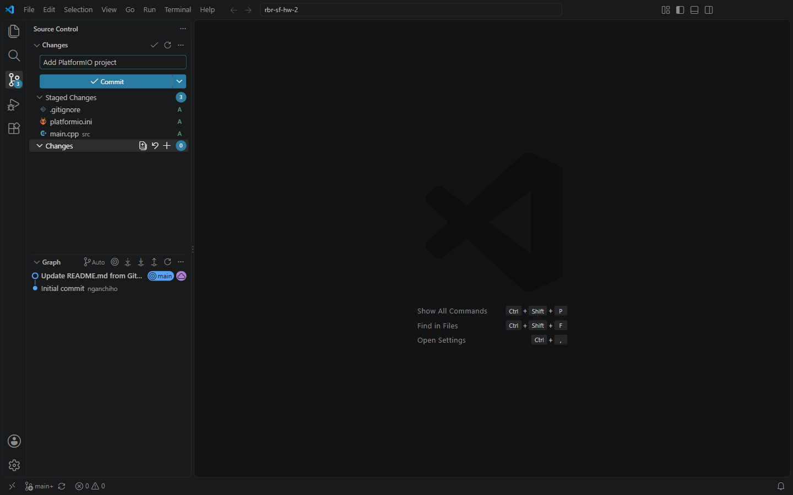
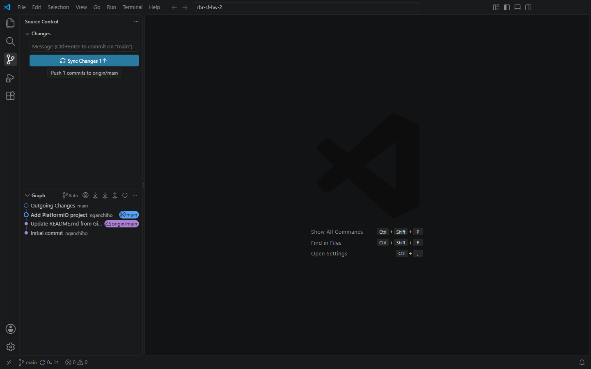

Go back to GitHub and refresh the page. You should see the new files and your commit message show up.

### Task 3: Branching
Go back to VSCode. In the bottom left, there is the name of the branch you are on, which should be `main`. Click it, then choose `Create new branch...`.
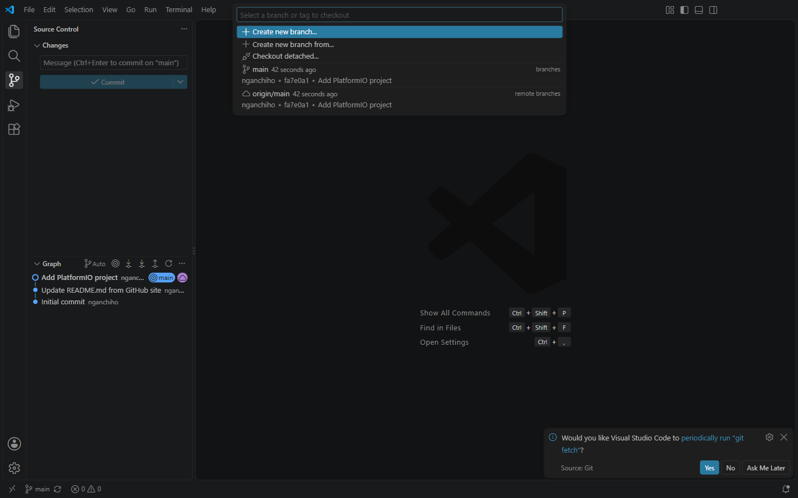

The branch name should be `can`. Press Enter to create the branch. The bottom left should now show `can` instead of `main`. You are now on the new branch, and the commits you make here would not affect `main`.

Copy everything inside [`commits/2`](commits/2) and paste it into the root of your repo. Choose `Replace` when asked, since `src/main.cpp` already exists.

Go back to Source Control. You should see `main.cpp` show up under `Changes` with an `M` next to it, meaning it is modified. Click the file to see what was changed, the left side is the old file and the right side is the new file.
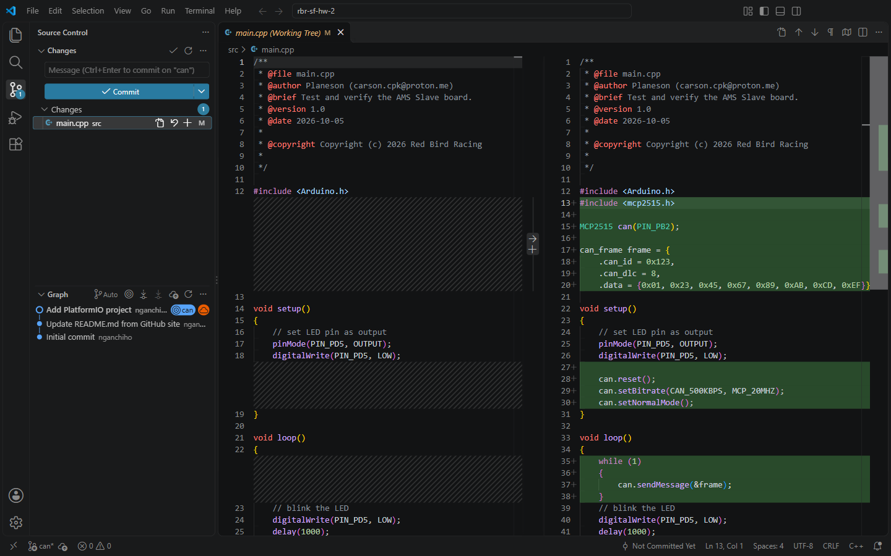

Stage the file. The commit message should be `Add CAN transmission`. Press the blue `Commit` button to commit your changes.

The branch only exists on your computer for now. Press the `Publish Branch` button to push the branch up. Go back to GitHub and refresh the page. Click the `main` button above the file list, you should see `can` show up. Choose it to see the files on that branch.
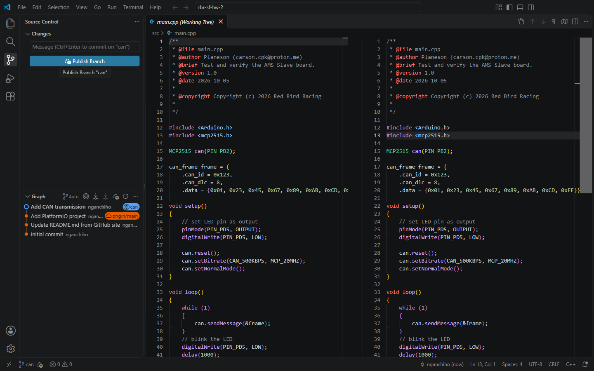
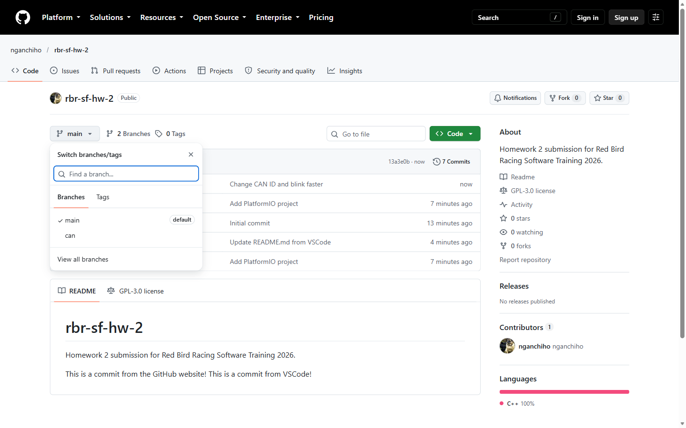

### Task 4: Merging
Go back to VSCode. Click the branch name in the bottom left, then choose `main` to switch back to it. Open `src/main.cpp`. You should see that the CAN code is gone, since that commit is only on `can`.

Open `README.md`. Add this line below it:  
`This is a commit from VSCode!`  
Save the file, then stage it. The commit message should be `Update README.md from VSCode`. Press the blue `Commit` button to commit your changes.

Look at the Graph. It only shows the branch you are on by default. Press the `Auto` button on the Graph, tick `All`, then press Enter. You should see that `main` and `can` now split into two lines, each having a commit the other does not have.
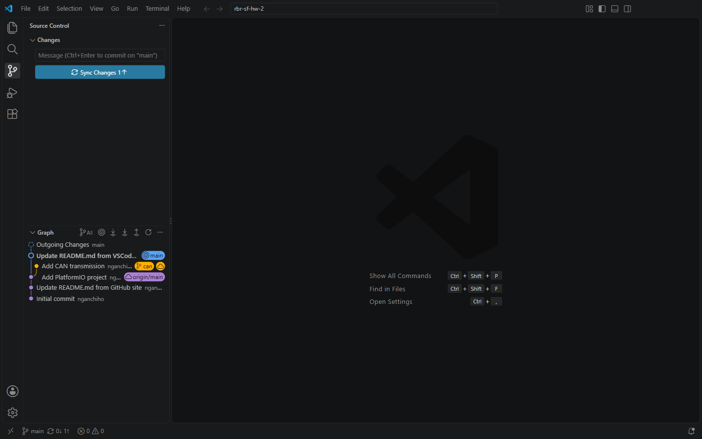

Now merge `can` into `main`. Make sure you are on `main`, the branch you are on is the one receiving the changes. In Source Control, press the `...` button at the top, then choose `Branch`, then `Merge...`. Choose `can`.
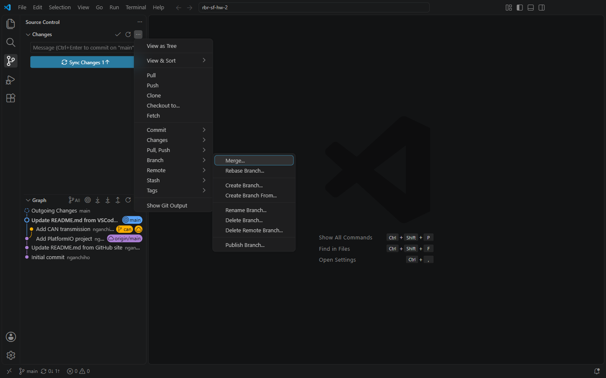

The two branches changed different files, so Git can merge them by itself. Look at the Graph. You should see the two lines join back together at a new commit called `Merge branch 'can'`. Open `src/main.cpp` and `README.md`. You should see both changes.
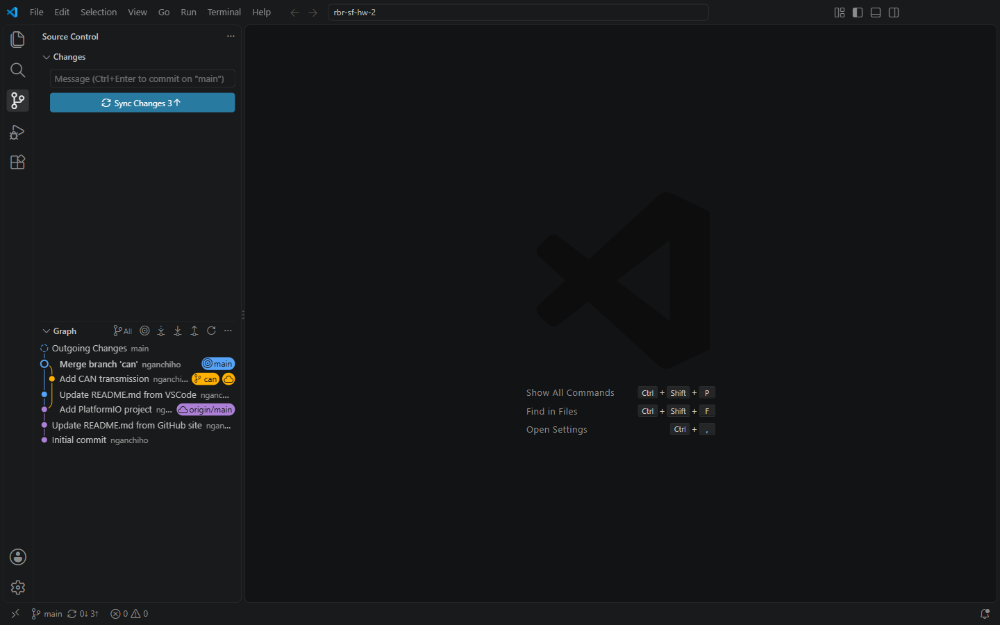

Press the `Sync Changes` button to push the commits up.

### Task 5: Pull Requests, resolving conflicts
Create a new branch called `slow-blink` from `main`. Copy everything inside [`commits/3`](commits/3) and paste it into the root of your repo, replacing `src/main.cpp`.

Stage the file. The commit message should be `Blink slower`. Commit your changes, then press the `Publish Branch` button to push the branch up.

Switch back to `main`. Copy everything inside [`commits/4`](commits/4) and paste it into the root of your repo, replacing `src/main.cpp`.

Stage the file. The commit message should be `Change CAN ID and blink faster`. Commit your changes, then press the `Sync Changes` button to push the commit up.

Go back to GitHub and refresh the page. You should see a yellow box saying `slow-blink had recent pushes`. Press the green `Compare & pull request` button. If the box is not there, go to the `Pull requests` tab and press the green `New pull request` button, then choose `slow-blink` as the `compare` branch.
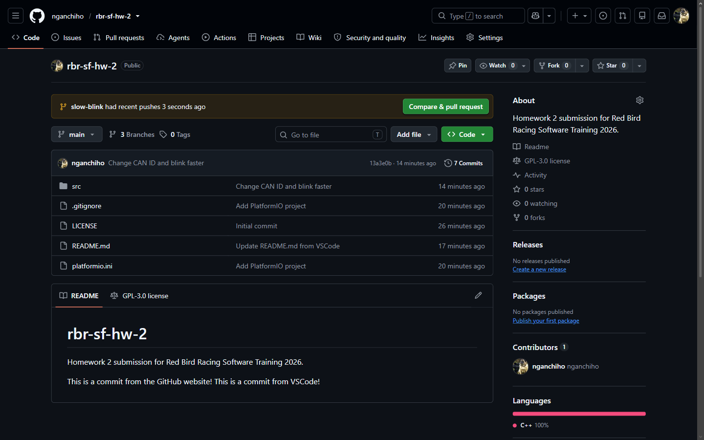

Make sure the base is `main` and the compare is `slow-blink`. You should see `Can't automatically merge.` next to them, which is expected. The title should be `Blink slower`, and the description should be `Changed the blink delay to 500 ms.`. Press the green `Create pull request` button to create the Pull Request.
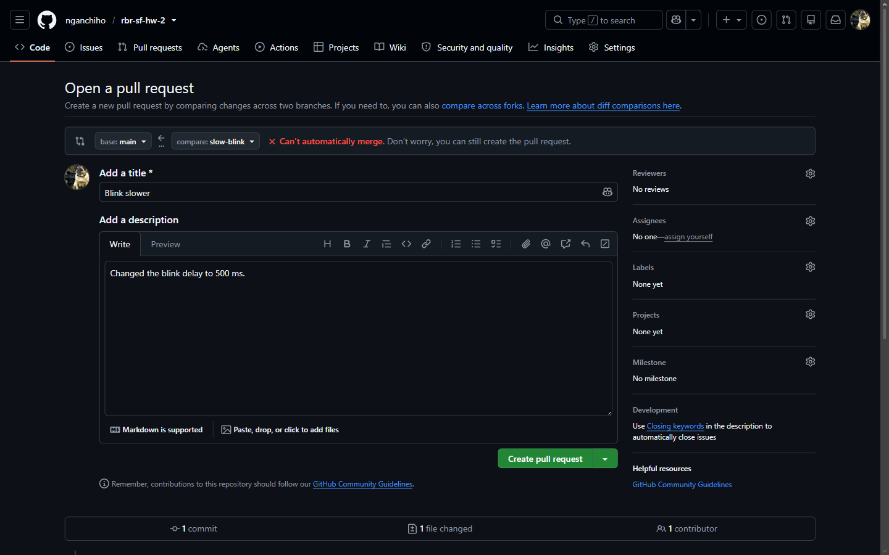

Scroll to the bottom of the Pull Request. You should see `This branch has conflicts that must be resolved`. Both branches changed the same lines of `src/main.cpp`, so Git does not know which one to keep, and you need to tell it.
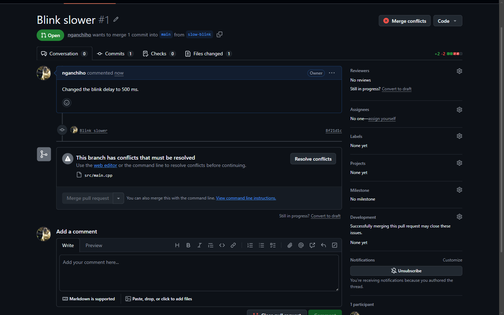

Go back to VSCode. Press the refresh button to pull, then switch to `slow-blink`. Merge `main` into `slow-blink`, the same way as Task 4 but choosing `main` this time.

You should see `main.cpp` show up under `Merge Changes` with a `!` next to it. Click the file, then press the blue `Resolve in Merge Editor` button in the bottom right.
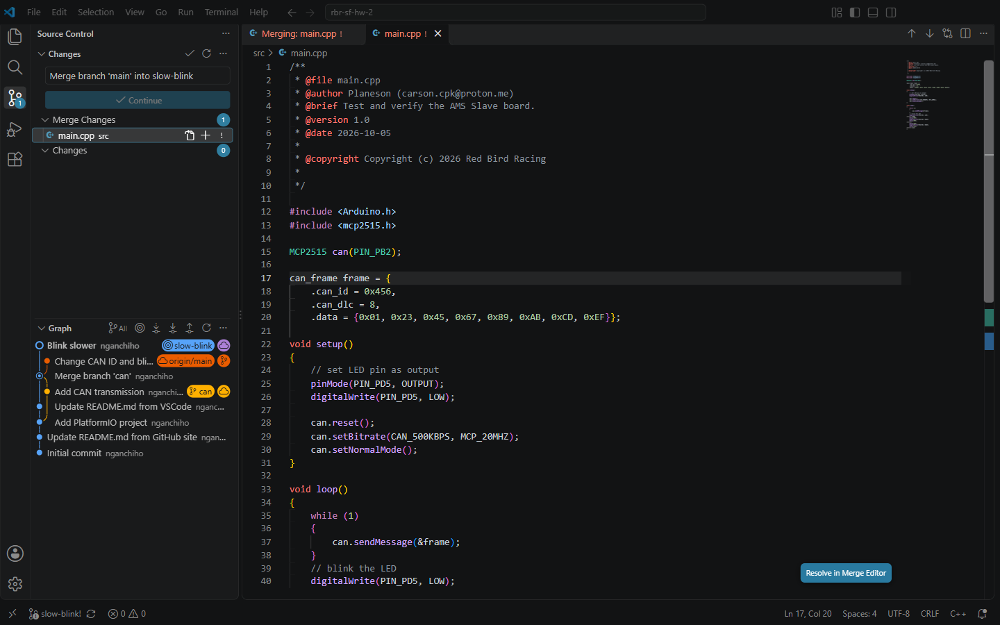

The Merge Editor shows `Incoming` (from `main`) on the left, `Current` (from `slow-blink`) on the right, and `Result` at the bottom. Note that `can_id` is already `0x456` in the result. Only `main` changed that line, so Git merged it by itself.
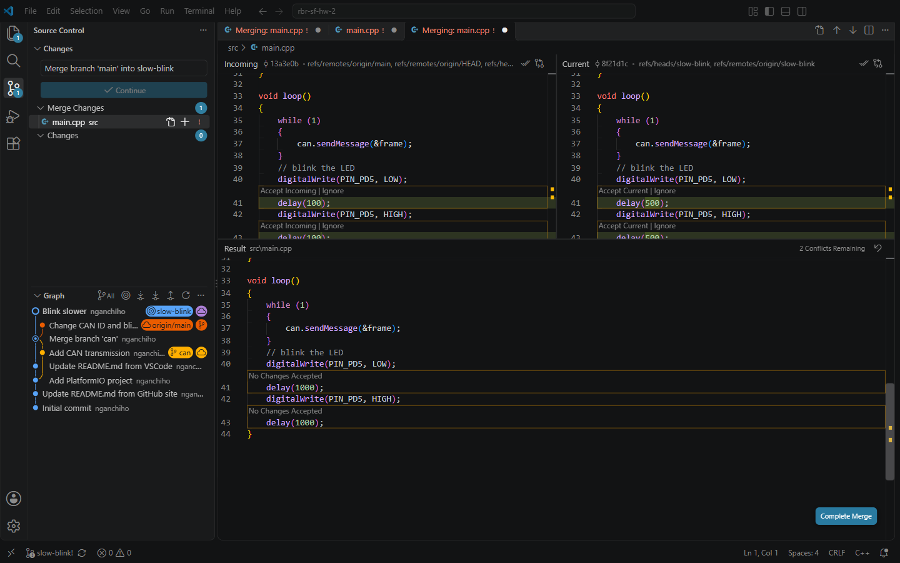

The top right of `Result` should say `2 Conflicts Remaining`, both in `loop()`. Press `Accept Current` above each of them on the right side to keep the changes from `slow-blink`. It should now say `0 Conflicts Remaining`, and the `loop()` in the result should use `delay(500)`.

Press the blue `Complete Merge` button in the bottom right. Go back to Source Control. The commit message is already filled in as `Merge branch 'main' into slow-blink`, leave it as is. Press the blue `Continue` button, then press the `Sync Changes` button to push the commit up.

Go back to GitHub and refresh the Pull Request. You should see `No conflicts with base branch`. Press the green `Merge pull request` button, then the green `Confirm merge` button. Press `Delete branch` after it is merged, as the branch is no longer needed.
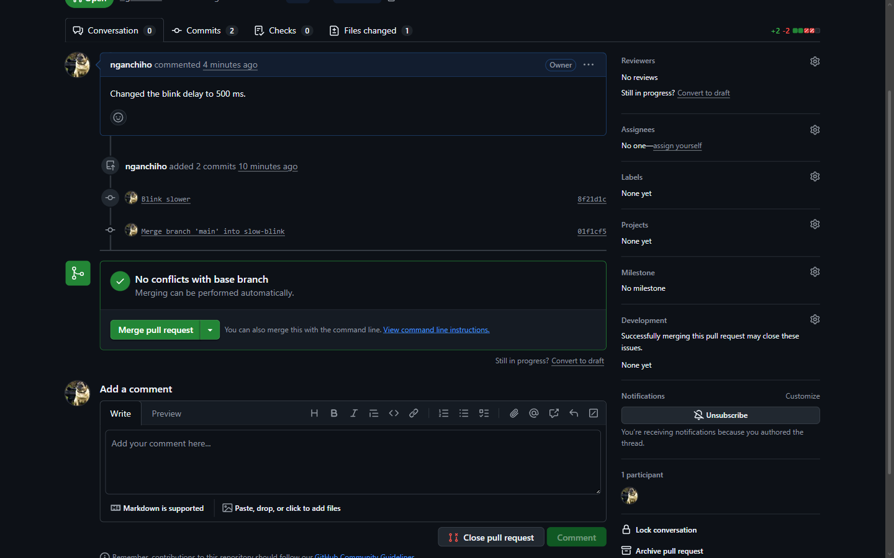

Note: merging Pull Requests is done from the GitHub website, so this does not count as a commit via the GitHub website.

Go back to VSCode. Switch back to `main`, then press the refresh button to pull the merged commits down.

### Task 6: CI/CD
Create a new branch called `ci` from `main`. Copy everything inside [`commits/ci`](commits/ci) and paste it into the root of your repo. Your repo should now have `Doxyfile` and `.github/workflows` with 2 files inside.

Stage all the files. The commit message should be `Add CI/CD workflows`. Commit your changes, then press the `Publish Branch` button to push the branch up.

Go back to GitHub and go to the `Actions` tab. You should see `PlatformIO CI` running on your commit. This workflow compiles your code every time you push, so you know right away if a commit breaks the build. Wait for it to finish, there should be a green tick next to it. Click it to see the output of each step.
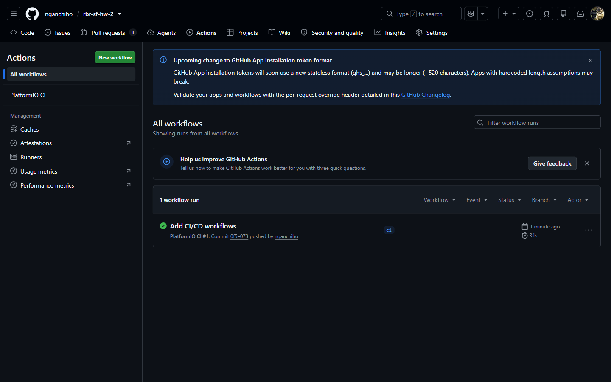
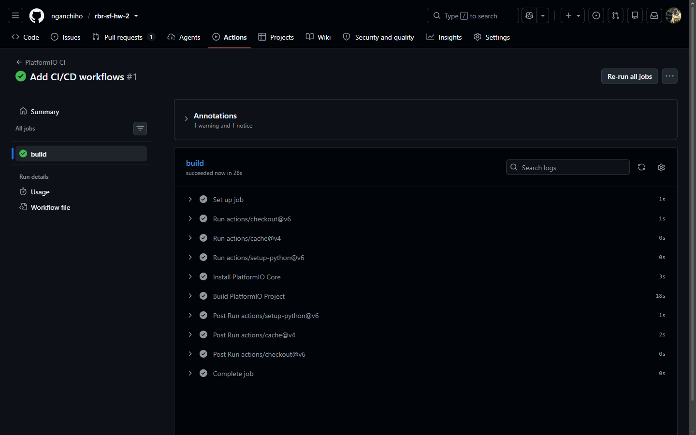

Create a Pull Request from `ci` to `main`. The title should be `Add CI/CD workflows`, and the description should be `Build the code and deploy the documentation automatically.`.

Scroll to the bottom of the Pull Request. You should see `All checks have passed`. If there is a red cross instead, click it to see what went wrong, fix it in VSCode, then commit and push to the same branch. The Pull Request would update by itself.
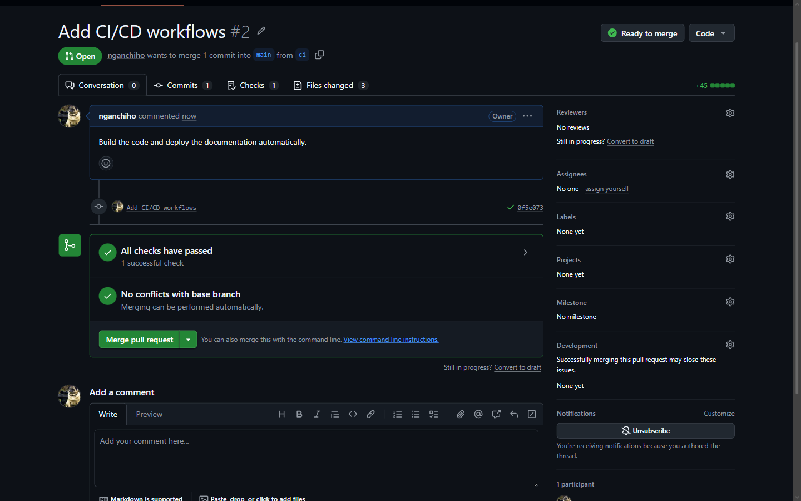

Merge the Pull Request, then delete the branch.

Go back to the `Actions` tab. You should see `Doxygen GitHub Pages Deploy Action` running. This workflow only runs when there is a push to `main`. It generates documentation from the comments in your code, then pushes it to a branch called `gh-pages`. Wait for it to finish.
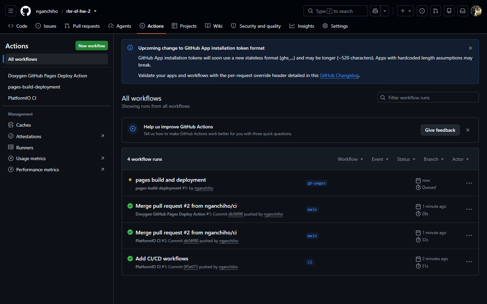

Go to `Settings`, then `Pages` on the left bar. Fill in the information required.
- Source: `Deploy from a branch`
- Branch: `gh-pages`
- Folder: `/ (root)`
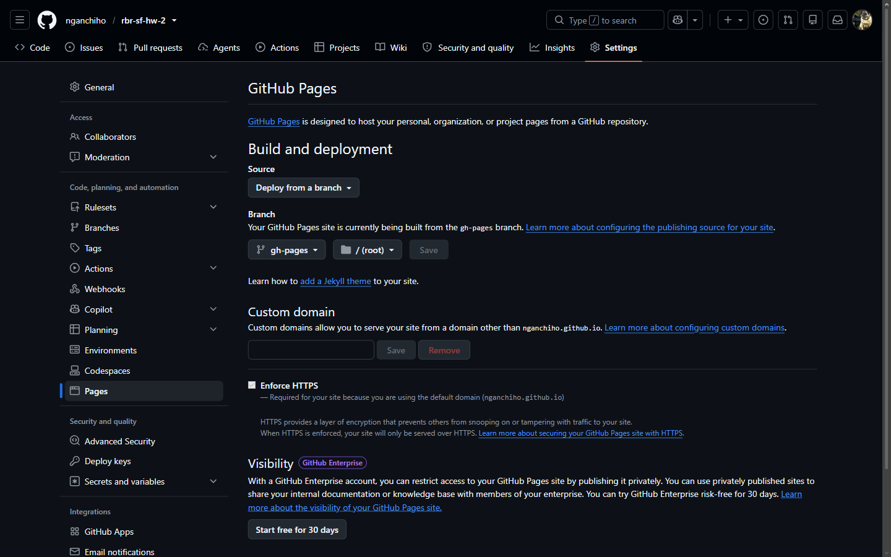

Press `Save`. Wait for a minute, then refresh the page. You should see `Your site is live at` followed by a link. Open it to see the documentation of your code.
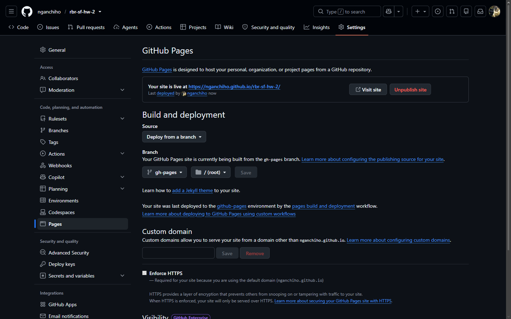
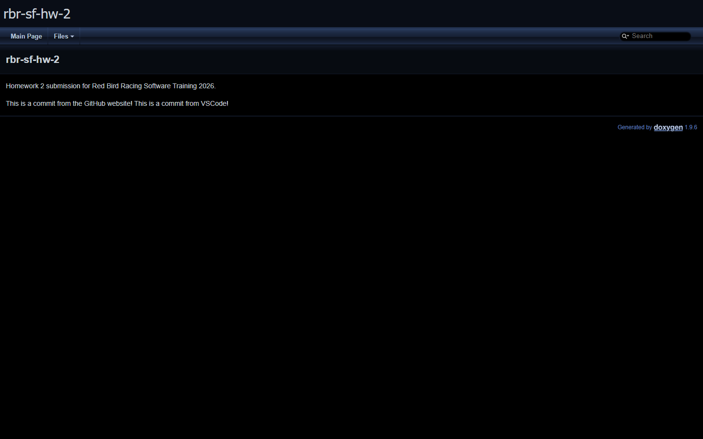

Go back to VSCode. Switch back to `main`, then press the refresh button to pull the merged commits down.

### Task 7: Give answers to questions in `answers.md`
Make sure you are on `main`. Create a new file called `answers.md` in the root of your repo, then answer the following questions in it. A few sentences for each question is enough.
1. What is the difference between fetching and pulling?
2. In Task 4, Git created a new commit called `Merge branch 'can'`. Why was a new commit needed?
3. In Task 5, both branches changed `src/main.cpp`. Why did `can_id` merge by itself but `loop()` did not?
4. In Task 6, which workflow ran when you pushed to `ci`, and which did not? Why?
5. Why is `.pio` in `.gitignore`?

Stage the file. The commit message should be `Add answers.md`. Commit your changes, then press the `Sync Changes` button to push the commit up.

## Checklist
- [x] Read the entire instructions file
- [ ] Finished all the tasks
- [ ] `answers.md` is filled in
- [ ] Link to repo sent on the [training website](https://rbrevrt.hkust.edu.hk/training)